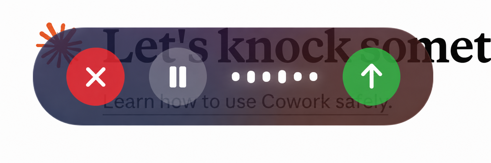
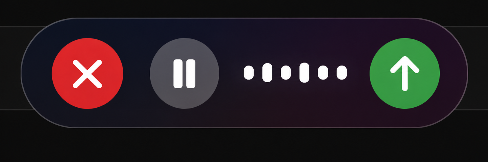
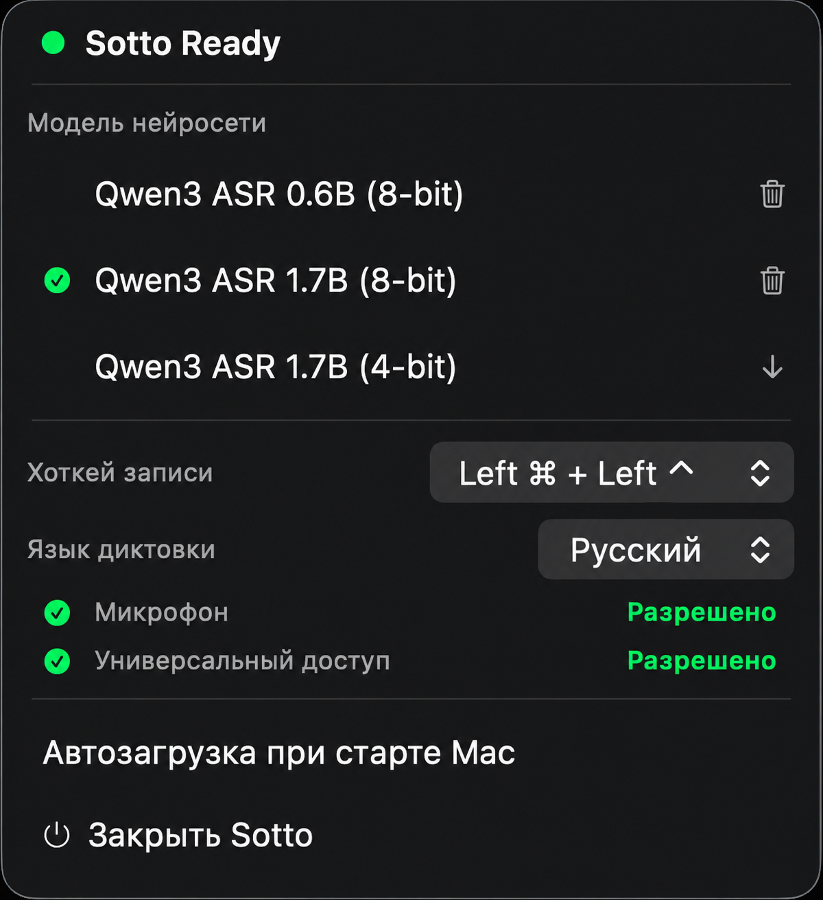

# Sotto

> Voice dictation, *sotto voce* — голосовая диктовка для macOS, полностью на устройстве.



<table>
  <tr>
    <td width="50%"></td>
    <td width="50%"></td>
  </tr>
  <tr>
    <td align="center"><sub>Кнопки управления записью &nbsp;·&nbsp; Recording controls</sub></td>
    <td align="center"><sub>Меню в menu bar &nbsp;·&nbsp; Menu bar dropdown</sub></td>
  </tr>
</table>

> 📝 Этот проект основан на [simicvm/whisper](https://github.com/simicvm/whisper) (MIT). Сохранена оригинальная архитектура (state machine, MLX-инференс, smart paste), но интерфейс, UX-логика записи и языковая поддержка существенно переработаны. Подробности — в разделе [Благодарности](#благодарности).

---

## 🇷🇺 Русский

### Что это

**Sotto** (от итал. *sotto voce* — «вполголоса») — приложение для голосовой диктовки на macOS, которое работает **полностью на вашем компьютере**. Никаких облаков, никакой отправки звука куда-либо. Аудио → текст происходит локально: через [Qwen3 ASR](https://huggingface.co/collections/mlx-community/qwen3-audio-6848a88a82aeef3874bf1543) на базе [Apple MLX](https://github.com/ml-explore/mlx-swift), либо через [GigaAM v3](https://github.com/salute-developers/GigaAM) на базе встроенного [gigastt](https://github.com/ekhodzitsky/gigastt) (ONNX Runtime + CoreML) — специализированной модели для русского языка.

Принцип работы простой: нажали хоткей → надиктовали → нажали ещё раз (или зелёную кнопку «Отправить») → текст автоматически вставляется в активное приложение через симуляцию `Cmd+V`.

### Возможности

- **Tap-to-toggle хоткей** — одно нажатие начинает запись, второе — заканчивает и транскрибирует. Удерживать ничего не нужно.
- **Интерактивная пилюля во время записи** — три кнопки прямо в оверлее:
  - **❌ Отмена** (красная) — выбросить запись и вернуться в idle
  - **⏸️ Пауза / возобновление** (белая) — приостановить захват без потери уже записанного
  - **📤 Отправить** (зелёная) — закончить запись досрочно и транскрибировать
- **Двуязычная диктовка** — переключатель **Русский / English** в menu bar. Применяется к следующей записи без перезагрузки модели.
- **Дизайн «Siri Aura»** — пилюля с угловым градиентом (синий → пурпурный → оранжевый), вращающимся со скоростью 360° за 6 секунд, и шестиполосным эквалайзером, реагирующим на громкость микрофона в реальном времени.
- **Перетаскиваемый оверлей** — потяните пилюлю мышью, чтобы поставить её в удобное место.
- **Четыре модели на выбор** — Qwen3 ASR `0.6B (8-bit)`, `1.7B (8-bit)`, `1.7B (4-bit)` (двуязычные, MLX) и **GigaAM v3** (только русский, ONNX/CoreML — заметно точнее на русской речи, с пунктуацией и расстановкой заглавных). Скачиваются по требованию, удаляются одной кнопкой в меню.
- **5 пресетов хоткея** — комбинации двух модификаторов с **различием левых и правых клавиш** (чтобы не пересекаться с системными шорткатами).
- **Smart paste** — текст вставляется через `Cmd+V` симуляцией Accessibility API; оригинальный буфер обмена сохраняется и восстанавливается; пробел добавляется автоматически, если курсор стоит после непробельного символа.
- **Автозапуск при старте Mac** — переключатель в меню (через `SMAppService`).
- **Полная локализация UI** на русский язык.
- **Работает офлайн** — после однократной загрузки модели интернет вообще не нужен.

### Системные требования

- **macOS 15.0+** (Sequoia или новее)
- **Apple Silicon** настоятельно рекомендуется — на Intel MLX работает медленно
- Разрешения **Микрофон** и **Универсальный доступ**
- ~1 GB свободного места на модель по умолчанию (`Qwen3 ASR 0.6B 8-bit`); для GigaAM v3 — ~1.2 GB

### Установка

#### Вариант 1 — Готовый `.app` (быстрый старт)

1. Скачайте `sotto.zip` из раздела [Releases](https://github.com/YFrtn/sotto/releases) (или по прямой ссылке на последний релиз: [`sotto.zip`](https://github.com/YFrtn/sotto/releases/latest/download/sotto.zip)).
2. Дважды кликните по архиву — macOS распакует `sotto.app`.
3. Перетащите `sotto.app` в `/Applications`.
4. Если macOS заблокирует первый запуск (это нормально для не-нотаризованных приложений) — кликните правой кнопкой → **Открыть** → подтвердите. Альтернатива — снять карантин в терминале:
   ```bash
   xattr -dr com.apple.quarantine /Applications/sotto.app
   ```
5. Запустите: `open /Applications/sotto.app` — иконка волны появится в menu bar справа.
6. Кликните по иконке → выдайте разрешения **Микрофон** и **Универсальный доступ** (откроется System Settings).
7. В меню выберите модель → нажмите **⬇️** → дождитесь окончания загрузки (статус «Downloading…»).
8. Когда статус сменится на **«Sotto Ready»** (зелёный) — всё готово.
9. Нажмите хоткей (по умолчанию **Left ⌘ + Left ⌃**), надиктуйте, нажмите хоткей ещё раз — текст вставится в активное окно.

> **Почему `/Applications`** — автозапуск через `SMAppService.mainApp` корректно работает только когда приложение лежит в `/Applications` и подписано Apple ID.

#### Вариант 2 — Сборка из исходников

Если хотите подписать своим Apple ID, изучить код или внести правки:

1. Откройте `sotto.xcodeproj` в Xcode 16+.
2. Target **sotto** → **Signing & Capabilities** → включите **Automatically manage signing** → выберите ваш Team (Personal Team тоже подходит для локального использования).
3. Соберите Release-бандл:
   ```bash
   xcodebuild -project sotto.xcodeproj -scheme sotto -configuration Release -derivedDataPath build clean build
   ```
4. Скопируйте в `/Applications`:
   ```bash
   cp -R "build/Build/Products/Release/sotto.app" /Applications/
   ```
5. Дальше как в шагах 5–9 выше.

### Как пользоваться

#### Хоткей

В меню Sotto, поле **Хоткей записи**, выберите один из 5 пресетов:

| Пресет | По умолчанию |
|---|---|
| `Left ⌘ + Left ⌃` | ✅ |
| `Left ⌘ + Left ⇧` |  |
| `Left ⌘ + Left ⌥` |  |
| `Left ⌃ + Left ⌥` |  |
| `Left ⌥ + Left ⇧` |  |

⚠️ **Хоткей различает левые и правые модификаторы** — `Right ⌘ + Left ⌃` не сработает. Это сделано специально, чтобы комбинация не конфликтовала с системными.

#### Цикл записи

1. Нажмите хоткей — внизу экрана появится пилюля.
2. Говорите. Эквалайзер на пилюле реагирует на громкость; градиент за капсулой пульсирует.
3. Дальше любой из вариантов:
   - **Хоткей повторно** или **📤 зелёная кнопка** — закончить запись и вставить текст
   - **⏸️ белая кнопка** — пауза; повторно — возобновить (звук не пишется во время паузы, но накопленный буфер сохраняется)
   - **❌ красная кнопка** — отменить, выбросить всё
4. Через 90 секунд запись автоматически останавливается (`AudioRecorder.defaultMaximumDuration`).

#### Выбор языка

В меню Sotto, поле **Язык диктовки** — `Русский` или `English`. Применяется на следующей записи. Модели `Qwen3 ASR` мультиязычные, перезагрузка не требуется. При выбранной **GigaAM v3** переключатель скрыт — модель распознаёт только русский.

#### Какую модель выбрать

| Модель | Языки | Движок | Место | Особенности |
|---|---|---|---|---|
| Qwen3 ASR 0.6B (8-bit) | RU + EN | MLX | ~1 GB | По умолчанию, самая лёгкая |
| Qwen3 ASR 1.7B (8-bit) | RU + EN | MLX | ~2 GB | Точнее, медленнее |
| Qwen3 ASR 1.7B (4-bit) | RU + EN | MLX | ~1.2 GB | Компромисс размера и точности |
| **GigaAM v3** | только RU | gigastt (ONNX + CoreML) | ~1.2 GB | **Лучшая точность на русском** (WER ~3.5% на чистой речи), пунктуация, заглавные, числа цифрами («семнадцатое июля» → «17 июля»), очень быстрая (~0.1 RTF) |

Если диктуете в основном по-русски — берите GigaAM v3. Если нужен английский — Qwen3.

> При первом включении GigaAM v3 скачиваются веса (~850 MB, затем квантизация в INT8) и при первом старте сервера — модель пунктуации RuPunct (~30 MB). Всё складывается в `~/Library/Caches/gigastt/models` и удаляется кнопкой 🗑️ из меню. Дальше — полностью офлайн.

#### Управление моделями

В разделе **Модель нейросети**:
- Выпадающий список с четырьмя моделями
- **⬇️** — скачать модель (загрузка идёт в фоне, прогресс виден в статусе)
- **🗑️** — удалить локальную копию модели (если она занимает место)

#### Разрешения

Sotto требует:
- **Микрофон** — для захвата звука
- **Универсальный доступ** (Accessibility) — для двух вещей:
  1. Симуляция `Cmd+V`, чтобы вставить транскрибированный текст в активное приложение
  2. Чтение символа перед курсором (нужно, чтобы решить, добавлять ли пробел перед текстом)

Если разрешения отозвали — кликните **«Проверить разрешения заново»** в меню.

> ⚠️ **Если выдали Универсальный доступ, а хоткей не срабатывает** — перезапустите Sotto. Глобальный слушатель хоткея (CGEvent tap) создаётся при старте приложения, и разрешение, выданное позже, на уже запущенный экземпляр не действует.

### Архитектура

```
sottoApp.swift              Точка входа SwiftUI App, привязка хоткея, lifecycle
AppState.swift              State machine: idle / loading / recording / paused
                            / transcribing / pasting / error

Services/
  TranscriptionService      Actor-фасад: маршрутизация между движками (MLX / gigastt),
                            MLX-инференс, скачивание моделей и кеш
  GigaSTTEngine             Sidecar-движок GigaAM v3: запуск gigastt serve (loopback,
                            порт 49876), ожидание /ready, WAV → POST /v1/transcribe,
                            гарантированное завершение процесса при выходе
  AudioRecorder             Захват через AVAudioEngine, RMS-уровень, ресэмпл в 16 кГц
                            Поддерживает pause/resume без потери буфера
  PasteController           Snapshot/restore буфера, симуляция Cmd+V

Resources/
  gigastt                   Автономный Rust-бинарник (ONNX Runtime + CoreML),
                            собран из github.com/ekhodzitsky/gigastt

Views/
  MenuBarView               Выпадающее меню (модели, разрешения, настройки, язык)
  RecordingOverlay          Пилюля «Siri Aura» с кнопками и эквалайзером
  OverlayManager            Жизненный цикл оверлея + позиционирование
  OverlayPanel              Невыделяющаяся прозрачная NSPanel (FloatingPanel)
                            с поддержкой перетаскивания

Models/
  STTModelDefinition        Реестр моделей (имя, репо HF, квантизация)

Hotkey/
  HotkeyDefinitions         CGEvent tap, 5 пресетов, persistence в UserDefaults,
                            различие левых/правых модификаторов
```

### Технологии

| Компонент | Что |
|---|---|
| Speech-to-Text модели | [Qwen3 ASR](https://huggingface.co/collections/mlx-community/qwen3-audio-6848a88a82aeef3874bf1543) (mlx-community) · [GigaAM v3](https://github.com/salute-developers/GigaAM) (SberDevices) |
| ML-фреймворк | [Apple MLX](https://github.com/ml-explore/mlx-swift) · [gigastt](https://github.com/ekhodzitsky/gigastt) (ONNX Runtime + CoreML) |
| Аудио-обвязка | [mlx-audio-swift](https://github.com/Blaizzy/mlx-audio-swift) |
| Скачивание моделей | [swift-transformers](https://github.com/huggingface/swift-transformers) (HuggingFace Hub) |
| UI | SwiftUI + AppKit (`NSPanel` для оверлея) |
| Захват звука | AVFoundation (`AVAudioEngine`) |
| Глобальный хоткей | Core Graphics CGEvent tap |
| Симуляция Cmd+V | Accessibility API |

### Лицензия

[MIT](LICENSE). Оригинальный код © 2026 Marko Simic. Модификации © 2026 Ералы Надыров.

### Благодарности

Проект построен на основе [simicvm/whisper](https://github.com/simicvm/whisper) — Marko Simic заложил архитектуру (state machine, MLX-инференс, smart paste с восстановлением буфера, плавающий оверлей).

В этом форке существенно переработаны:

- **Модель взаимодействия с хоткеем**: с push-to-talk (удерживать) на tap-to-toggle (одно нажатие).
- **Состояние `paused`** в state machine + `AudioRecorder.pause()` / `resume()`, сохраняющие накопленный буфер.
- **Дизайн оверлея**: вместо круга с MeshGradient — пилюля «Siri Aura» с угловым градиентом, эквалайзером и тремя интерактивными кнопками (отмена/пауза/отправка).
- **Перетаскивание оверлея** — добавлены `move(by:)` и `clamp(origin:)` для удобного позиционирования.
- **Picker языка диктовки** RU/EN, читаемый из `UserDefaults` каждой транскрибацией.
- **Полная локализация menu bar UI** на русский.
- **Bundle ID и брендинг** — приложение переименовано из `whisper` в `sotto`.
- **Движок GigaAM v3** — подключён [gigastt](https://github.com/ekhodzitsky/gigastt) как встроенный sidecar-сервер (ONNX Runtime + CoreML) для более точного распознавания русского.

Отдельное спасибо:

- [**GigaAM**](https://github.com/salute-developers/GigaAM) от SberDevices — модель распознавания русской речи
- [**gigastt**](https://github.com/ekhodzitsky/gigastt) — Rust-движок, через который GigaAM v3 работает в Sotto

---

## 🇬🇧 English

### What is Sotto

**Sotto** (from Italian *sotto voce* — "in a low voice") is a macOS voice dictation app that runs **entirely on your machine**. No cloud, no audio leaves your computer. Speech-to-text happens locally: via [Qwen3 ASR](https://huggingface.co/collections/mlx-community/qwen3-audio-6848a88a82aeef3874bf1543) on top of [Apple MLX](https://github.com/ml-explore/mlx-swift), or via [GigaAM v3](https://github.com/salute-developers/GigaAM) served by the bundled [gigastt](https://github.com/ekhodzitsky/gigastt) engine (ONNX Runtime + CoreML) — a Russian-specialized model.

Workflow: press a hotkey → speak → press it again (or hit the green Send button) → the transcribed text is pasted into the active application via simulated `Cmd+V`.

### Features

- **Tap-to-toggle hotkey** — one press starts recording, another stops and transcribes. No need to hold anything.
- **Interactive pill overlay** with three buttons:
  - **❌ Cancel** (red) — discard the recording and return to idle
  - **⏸️ Pause / Resume** (white) — pause capture without losing the accumulated buffer
  - **📤 Send** (green) — finish recording early and transcribe
- **Bilingual dictation** — Russian / English picker in the menu bar. Applies to the next recording without reloading the model.
- **"Siri Aura" design** — pill overlay with an angular gradient (blue → purple → orange) rotating 360° every 6 seconds, plus a six-bar equalizer that reacts to mic level in real time.
- **Draggable overlay** — drag the pill anywhere on screen.
- **Four model options** — Qwen3 ASR `0.6B (8-bit)`, `1.7B (8-bit)`, `1.7B (4-bit)` (bilingual, MLX) and **GigaAM v3** (Russian-only, ONNX/CoreML — noticeably more accurate on Russian speech, with punctuation and casing). Downloaded on demand, removable per-model.
- **5 hotkey presets** — two-modifier combinations with **left/right modifier discrimination** (so they don't clash with system shortcuts).
- **Smart paste** — text is pasted via simulated `Cmd+V` through the Accessibility API; the original clipboard contents are preserved and restored; a leading space is added automatically when the cursor is right after a non-whitespace character.
- **Run on startup** — toggle in the menu (uses `SMAppService`).
- **Russian-localized UI** (English available via in-app strings, but the menu copy is currently RU-only).
- **Fully offline** after a one-time model download.

### Requirements

- **macOS 15.0+** (Sequoia or later)
- **Apple Silicon** strongly recommended — MLX is much slower on Intel
- **Microphone** and **Accessibility** permissions
- ~1 GB of free space for the default model (`Qwen3 ASR 0.6B 8-bit`); ~1.2 GB for GigaAM v3

### Installation

#### Option 1 — Pre-built `.app` (quick start)

1. Download `sotto.zip` from the [Releases](https://github.com/YFrtn/sotto/releases) page (direct link to the latest: [`sotto.zip`](https://github.com/YFrtn/sotto/releases/latest/download/sotto.zip)).
2. Double-click the archive — macOS unpacks `sotto.app`.
3. Drag `sotto.app` into `/Applications`.
4. If macOS blocks the first launch (normal for un-notarized apps) — right-click → **Open** → confirm. Alternatively, remove quarantine via terminal:
   ```bash
   xattr -dr com.apple.quarantine /Applications/sotto.app
   ```
5. Launch it: `open /Applications/sotto.app` — a waveform icon appears in the menu bar.
6. Click the icon → grant **Microphone** and **Accessibility** permissions (System Settings opens automatically).
7. Pick a model from the menu → click **⬇️** → wait for the download to finish.
8. Once the status turns **"Sotto Ready"** (green) — you're set.
9. Press the hotkey (default: **Left ⌘ + Left ⌃**), speak, press it again — text gets pasted into the active window.

> **Why `/Applications`** — Run on Startup uses `SMAppService.mainApp`, which works reliably only when the app lives in `/Applications` and is properly signed.

#### Option 2 — Build from source

If you want to sign with your own Apple ID, study the code, or modify it:

1. Open `sotto.xcodeproj` in Xcode 16+.
2. Target **sotto** → **Signing & Capabilities** → enable **Automatically manage signing** → pick your Team (Personal Team works for local use).
3. Build a Release bundle:
   ```bash
   xcodebuild -project sotto.xcodeproj -scheme sotto -configuration Release -derivedDataPath build clean build
   ```
4. Copy into `/Applications`:
   ```bash
   cp -R "build/Build/Products/Release/sotto.app" /Applications/
   ```
5. Continue from steps 5–9 above.

### Usage

#### Hotkey

In the Sotto menu, **Хоткей записи** (Recording hotkey) field, pick one of 5 presets:

| Preset | Default |
|---|---|
| `Left ⌘ + Left ⌃` | ✅ |
| `Left ⌘ + Left ⇧` |  |
| `Left ⌘ + Left ⌥` |  |
| `Left ⌃ + Left ⌥` |  |
| `Left ⌥ + Left ⇧` |  |

⚠️ **Left/right modifiers are distinct** — `Right ⌘ + Left ⌃` won't trigger anything. This is intentional, to avoid colliding with system shortcuts.

#### Recording cycle

1. Press the hotkey — a pill appears at the bottom of the screen.
2. Speak. The equalizer on the pill reacts to mic level; the gradient pulses.
3. To finish, any of:
   - **Press the hotkey again** or **📤 green button** — finish recording and paste the text
   - **⏸️ white button** — pause; press again to resume (audio is not captured during pause, but the accumulated buffer is preserved)
   - **❌ red button** — cancel and discard
4. After 90 seconds the recording stops automatically (`AudioRecorder.defaultMaximumDuration`).

#### Language switching

In the Sotto menu, **Язык диктовки** (Dictation language) field — `Русский` or `English`. Applies to the next recording. The Qwen3 ASR models are multilingual, so no reload is needed. When **GigaAM v3** is selected the picker is hidden — the model is Russian-only.

#### Choosing a model

| Model | Languages | Engine | Disk | Notes |
|---|---|---|---|---|
| Qwen3 ASR 0.6B (8-bit) | RU + EN | MLX | ~1 GB | Default, lightest |
| Qwen3 ASR 1.7B (8-bit) | RU + EN | MLX | ~2 GB | More accurate, slower |
| Qwen3 ASR 1.7B (4-bit) | RU + EN | MLX | ~1.2 GB | Size/accuracy tradeoff |
| **GigaAM v3** | RU only | gigastt (ONNX + CoreML) | ~1.2 GB | **Best Russian accuracy** (WER ~3.5% clean speech), punctuation, casing, spoken numbers → digits, very fast (~0.1 RTF) |

If you mostly dictate in Russian — pick GigaAM v3. If you need English — pick Qwen3.

> On first use GigaAM v3 downloads its weights (~850 MB, then INT8-quantized) and, on the first server start, the RuPunct punctuation model (~30 MB). Everything lands in `~/Library/Caches/gigastt/models` and can be removed via the 🗑️ button. Fully offline afterwards.

#### Model management

Under **Модель нейросети** (Neural model):
- Dropdown with four models
- **⬇️** — download the model (progress is shown in the status line)
- **🗑️** — remove the local copy

#### Permissions

Sotto needs:
- **Microphone** — to capture audio
- **Accessibility** — for two things:
  1. Simulate `Cmd+V` to paste the transcribed text into the active app
  2. Read the character before the cursor, so it knows whether to prepend a space

If you revoke a permission, click **«Проверить разрешения заново»** (Re-check permissions) in the menu.

> ⚠️ **If you granted Accessibility but the hotkey does nothing** — restart Sotto. The global hotkey listener (CGEvent tap) is created at app launch, and a permission granted afterwards does not apply to the already-running instance.

### Architecture

```
sottoApp.swift              SwiftUI App entry point, hotkey wiring, lifecycle
AppState.swift              State machine: idle / loading / recording / paused
                            / transcribing / pasting / error

Services/
  TranscriptionService      Actor façade: routes between engines (MLX / gigastt),
                            MLX inference, model download and cache
  GigaSTTEngine             GigaAM v3 sidecar engine: launches gigastt serve
                            (loopback, port 49876), waits for /ready, WAV →
                            POST /v1/transcribe, guaranteed teardown on quit
  AudioRecorder             AVAudioEngine capture, RMS level, 16 kHz resampling
                            Supports pause/resume without losing the buffer
  PasteController           Pasteboard snapshot/restore, Cmd+V simulation

Resources/
  gigastt                   Self-contained Rust binary (ONNX Runtime + CoreML),
                            built from github.com/ekhodzitsky/gigastt

Views/
  MenuBarView               Dropdown menu (models, permissions, settings, language)
  RecordingOverlay          "Siri Aura" pill with buttons and equalizer
  OverlayManager            Overlay lifecycle and positioning
  OverlayPanel              Non-activating transparent NSPanel (FloatingPanel)
                            with drag support

Models/
  STTModelDefinition        Model registry (name, HF repo, quantization)

Hotkey/
  HotkeyDefinitions         CGEvent tap, 5 presets, UserDefaults persistence,
                            left/right modifier discrimination
```

### Tech Stack

| Component | What |
|---|---|
| Speech-to-text models | [Qwen3 ASR](https://huggingface.co/collections/mlx-community/qwen3-audio-6848a88a82aeef3874bf1543) (mlx-community) · [GigaAM v3](https://github.com/salute-developers/GigaAM) (SberDevices) |
| ML framework | [Apple MLX](https://github.com/ml-explore/mlx-swift) · [gigastt](https://github.com/ekhodzitsky/gigastt) (ONNX Runtime + CoreML) |
| Audio bindings | [mlx-audio-swift](https://github.com/Blaizzy/mlx-audio-swift) |
| Model download | [swift-transformers](https://github.com/huggingface/swift-transformers) (HuggingFace Hub) |
| UI | SwiftUI + AppKit (`NSPanel` for the overlay) |
| Audio capture | AVFoundation (`AVAudioEngine`) |
| Global hotkey | Core Graphics CGEvent tap |
| Cmd+V simulation | Accessibility API |

### License

[MIT](LICENSE). Original code © 2026 Marko Simic. Modifications © 2026 Yeraly Nadyrov.

### Credits

Built on top of [simicvm/whisper](https://github.com/simicvm/whisper) — Marko Simic laid down the architecture (state machine, MLX inference, smart paste with clipboard restoration, floating overlay).

In this fork the following has been substantially reworked:

- **Hotkey interaction model**: from push-to-talk (hold) to tap-to-toggle (one press).
- **`paused` state** in the state machine + `AudioRecorder.pause()` / `resume()` that preserve the accumulated buffer.
- **Overlay design**: from a circular MeshGradient to a "Siri Aura" pill with an angular gradient, equalizer, and three interactive buttons (Cancel / Pause / Send).
- **Draggable overlay** — added `move(by:)` and `clamp(origin:)` for repositioning.
- **Russian / English language picker**, read from `UserDefaults` on every transcription.
- **Full Russian localization** of the menu bar UI.
- **Bundle ID and branding** — renamed from `whisper` to `sotto`.
- **GigaAM v3 engine** — integrated [gigastt](https://github.com/ekhodzitsky/gigastt) as a bundled sidecar server (ONNX Runtime + CoreML) for more accurate Russian recognition.

Special thanks to:

- [**GigaAM**](https://github.com/salute-developers/GigaAM) by SberDevices — the Russian speech recognition model
- [**gigastt**](https://github.com/ekhodzitsky/gigastt) — the Rust engine that powers GigaAM v3 inside Sotto
